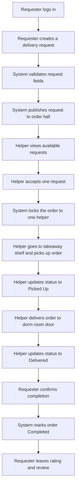
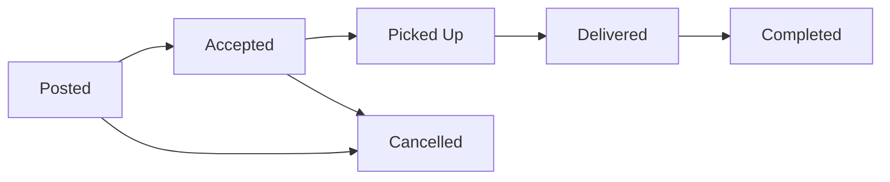

# Dorm Takeaway Help Business Flow

## Scope
This flow is designed for the MVP of the dorm takeaway help mini-program. The product focus is the last-meter handoff from the takeaway shelf downstairs to the student's dorm room door.

## Core Roles
- Requester: the student who wants someone to bring the takeaway upstairs
- Helper: the student who accepts the request and delivers the takeaway
- System: the mini-program backend that records status, matching, and confirmation

## Main Flow

## State Flow

## Business Rules
- One order can only be accepted by one helper.
- Only the requester can cancel an order, and only before the order is marked `Picked Up`.
- Only the assigned helper can change the order from `Accepted` to `Picked Up` and `Delivered`.
- Only the requester can confirm `Completed`.
- Payment can be recorded after the order is completed. For MVP, this can be a fixed service fee field and a payment status field, without real online payment integration.

## Exception Cases
- No helper accepts the order: the request remains in `Posted` until timeout or manual cancellation.
- Wrong helper tries to update status: the backend must reject the action.
- Multiple users try to accept the same order: only the first successful request should lock the order.
- Requester does not confirm after delivery: the order remains in `Delivered` and can be manually reviewed later.

## Suggested MVP Boundary
- Include: create request, accept request, order status updates, completion confirmation, basic rating, simple fee field
- Exclude for now: real-time chat, live map, online payment gateway, refund rules, multi-order dispatch
